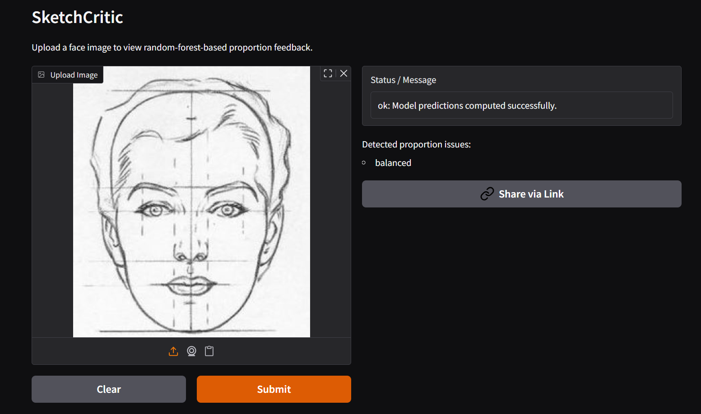
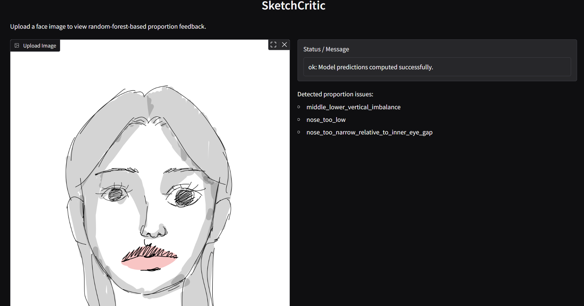
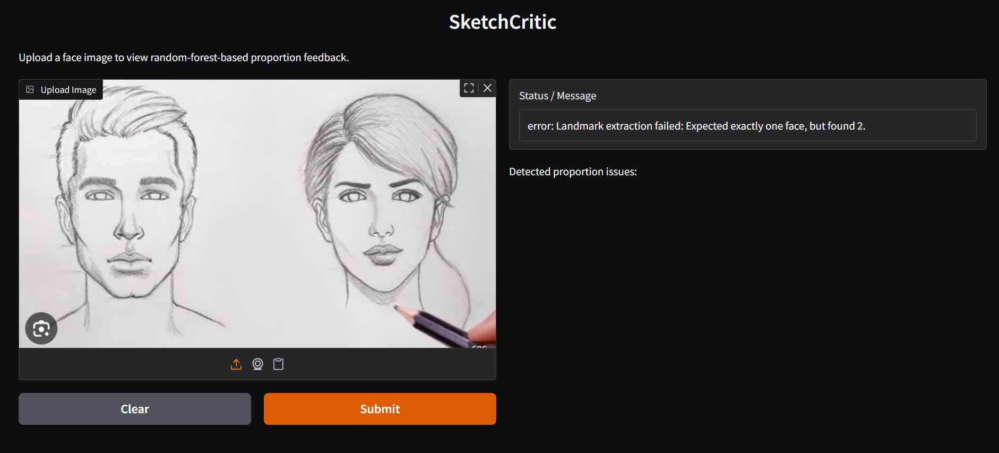
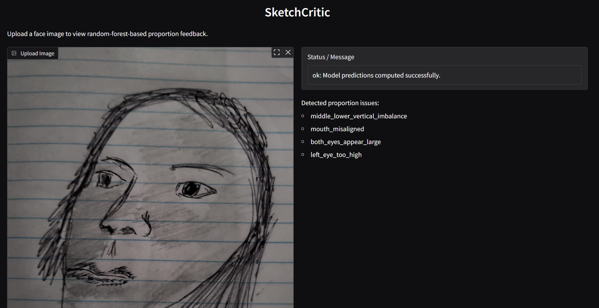
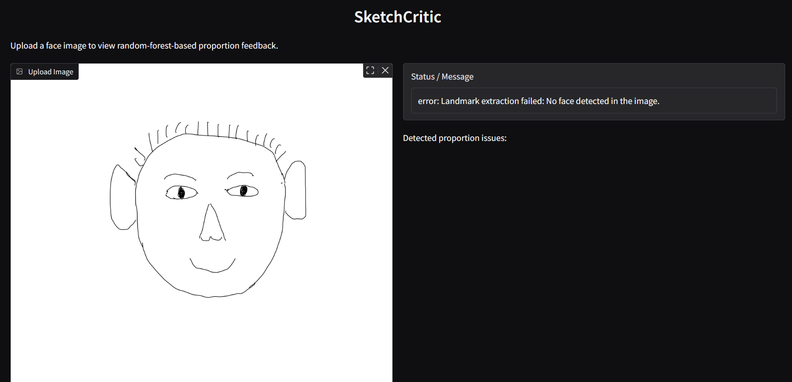

# SketchCritic

SketchCritic is a tool that helps artists improve their skills by pointing out any proportion issues in their drawing. The user uploads a front facing portrait drawing and the tool will point out any proportional issues it has.

## What it Does

SketchCritic takes a face image, runs MediaPipe Face Landmarker to locate facial landmarks, converts those landmarks into interpretable geometric features, and uses a trained Random Forest model to predict facial proportion issues such as eye-size imbalance, vertical placement issues, or nose-width relationships.

## Quick Start

Access deployed app here:

https://huggingface.co/spaces/rachelyu0406/SketchCritic

Install dependencies:

```bash
pip install -r requirements.txt
```

Generate a small synthetic dataset:

```bash
python src/synth_data.py data/sketchcritic_synthetic.csv --samples-per-class 4 --samples-per-multilabel-combo 1
```

Train the Random Forest model:

```bash
python src/train_random_forest.py data/sketchcritic_synthetic.csv models/sketchcritic_rf.pkl
```

Run a prediction on one image:

```bash
python src/predict.py image.jpg models/face_landmarker.task models/sketchcritic_rf.pkl
```

Launch the local Gradio app:

```bash
python app.py
```

## Video Links

- Demo video: 
- Technical walkthrough: 

## Evaluation

The final Random Forest configuration used `n_estimators = 200` and achieved:

- accuracy: `0.7949`
- precision: `0.9783`
- recall: `0.8491`
- F1: `0.9091`

The Random Forest model was also evaluated for inference efficiency on 194 samples over 100 timed runs. Average batch inference time was `43.22 ms`, average per-sample latency was `0.223 ms`, and throughput was `4488.27` samples per second.

Two successful qualitative examples are shown below. The first is an ideal drawing that the system classifies as balanced, and the second is a more generic drawing where the system detects proportion issues.





### Error Analysis

The project also includes qualitative error analysis using failure-case examples. The current system does not work well in three common situations:

- when there are two or more faces in the input image
- when the drawing is not front-facing and is shown from another angle
- when the drawing is too simple for MediaPipe to detect a face reliably

These failure cases are illustrated below.







More detailed evaluation, model-improvement logs, cross-validation comparisons, and Random Forest inference-efficiency measurements are documented in `notebooks/evaluate_models.ipynb`.

## Individual Contributions

This project was completed individually.
